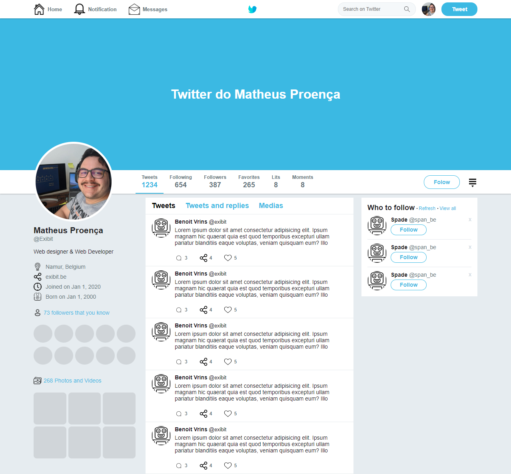

## CÓPIA DA PÁGINA DO TWITTER
 
Esse projeto foi para confirmar os meus conhecimentos em [Flexbox](https://www.w3schools.com/css/css3_flexbox.asp) e na utilização de HTML e CSS.
 

  

 
## Contato
 

 
## Desenvolvedor
 
[ Matheus Proença](https://github.com/mroenca40)
 
### Contribuições
 
Caso você queira fazer alguma contribuição, fique a vontade para comentar, fazer pull requests. Toda ajuda para melhorar o código é bem vinda! :D
 
###

